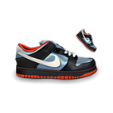

#### *Lottery-turntable 九宫格抽奖jQuery插件*
#### *本插件是修改自网友插件：http://www.sucaihuo.com/js/129.html。*
#### *增加了自由设定奖品抽奖机率*
#### *增加了抽中以后的提示文字*

### 配置项
#### *index: `Number` (default: `0`)*
当前转动到哪个位置，起点位置。
#### *count: `Function(element)` (default: `undefined`)*
总共有多少个位置
#### *timer: `Number` (default: `0`)*
setTimeout的ID，用clearTimeout清除。
#### *speed: `Number` (default: `0`)*
初始转动速度
#### *timers: `Number` (default: `0`)*
转动次数
#### *cycle: `Number` (default: `0`)*
转动基本次数：即至少需要转动多少次再进入抽奖环节
#### *prize: `Number` (default: `0`)*
中奖位置
#### *probability: `Array` (default: `0`)*
设置所有奖品几率//所有奖品几率总和是100。
[0,8,20,30,40,50,60,70,80,85,90,95]对应的每个奖品的机率是[8,12,10,10……,5]
#### *giftTipsArr: `Array` (default: `0`)*
设置所有奖品提示文字
#### *giftTip: `String` (default: `""`)*
初始化提示文字

### 方法

#### lottery.init()

初始化运行(非配置参数)

#### lottery.roll(inverval)

开始运行

#### lottery.stop(selector)

停止运行

### 提示
* 属性设置方式：
lottery.speend=20;


```

## 怎么使用
* 样式*
```HTML
#lottery{width:574px;height:584px;margin:20px auto 0;background:url(images/bg.jpg) no-repeat;padding:50px 55px;}
#lottery table td{width:142px;height:142px;text-align:center;vertical-align:middle;font-size:24px;color:#333;font-index:-999}
#lottery table td a{width:284px;height:284px;line-height:150px;display:block;text-decoration:none;}
#lottery table td.active{background-color:#ea0000;}
```
*js脚本*
```HTML
var lottery={
	index:-1,	//当前转动到哪个位置，起点位置
	count:0,	//总共有多少个位置
	timer:0,	//setTimeout的ID，用clearTimeout清除
	speed:20,	//初始转动速度
	times:0,	//转动次数
	cycle:50,	//转动基本次数：即至少需要转动多少次再进入抽奖环节
	prize:-1,	//中奖位置
	probability:[0,8,20,30,40,50,60,70,80,85,90,95],//设置奖品几率//所有奖品几率总和是100
	giftTipsArr:["宝马x1","宝马x2","宝马x3","宝马x4","奔驰x1","奔驰x2","奔驰x3","奔驰x4",,"宾利x1","宾利x2","宾利x3","宾利x4"],
	giftTip:'',
	init:function(id){
	//初始化位置总数。起始位置标记
		if ($("#"+id).find(".lottery-unit").length>0) {
			$lottery = $("#"+id);
			$units = $lottery.find(".lottery-unit");
			this.obj = $lottery;
			this.count = $units.length;
			$lottery.find(".lottery-unit-"+this.index).addClass("active");
		};
	},
	roll:function(){
		var index = this.index;
		var count = this.count;
		var lottery = this.obj;
		$(lottery).find(".lottery-unit-"+index).removeClass("active");
		//当前位置更新
		index += 1;
		if (index>count-1) {
			index = 0;
		};
		$(lottery).find(".lottery-unit-"+index).addClass("active");
		this.index=index;
		return false;
	},
	stop:function(index){
	//停止
		this.prize=index;
		return false;
	}
};

function roll(){
	lottery.times += 1;
	lottery.roll();
	//如果转动次数超过设置最少转动次数+10且中将位置是当前转动到的位置
	if (lottery.times > lottery.cycle+10 && lottery.prize==lottery.index) {
		clearTimeout(lottery.timer);
		 lottery.giftTip=lottery.giftTipsArr[lottery.prize];
		var t=setTimeout("alert('恭喜您抽到了'+lottery.giftTip);",500)
		lottery.prize=-1;
		lottery.times=0;
		click=false;
	}else{
	//如果转动次数小于设置最少转动次数，更新转动次数
		if (lottery.times<lottery.cycle) {
			lottery.speed -= 10;
		}else if(lottery.times==lottery.cycle) {//如果转动次数等于最少转动次数时确定奖品
			var random = Math.random()*100|0;//根据随机数确定奖品
			var probability=lottery.probability;
			var nowIndex=-1;
			for(var i=0,length=probability.length;i<length;i++){
			if(random>=probability[length-1]){
				nowIndex=length-1;
			}else{
				if(random>=probability[i]&&random<probability[i+1]){
					nowIndex=i;
					}
				}
			}
			lottery.prize = nowIndex;		//在此处设置奖品位置
		}else{
		    //如果转动次数超过设置最少转动次数+10 且奖品位置跟起始位置太近
			if (lottery.times > lottery.cycle+10 && ((lottery.prize==0 && lottery.index==7) || lottery.prize==lottery.index+1)) {
				lottery.speed += 110;//增加转动速度
			}else{
				lottery.speed += 20;//增加转动速度
			}
		}
		if (lottery.speed<40) {
		//设置最少转动速度为40
			lottery.speed=40;
		};
		//console.log(lottery.times+'^^^^^^'+lottery.speed+'^^^^^^^'+lottery.prize);
		lottery.timer = setTimeout(roll,lottery.speed);
	}
	return false;
}

var click=false;

window.onload=function(){
	lottery.init('lottery');
	$("#lottery a").click(function(){
		if (click) {
			return false;
		}else{
			lottery.speed=100;
			roll();
			click=true;
			return false;
		}
	});
};
```
*html结构*
```HTML
<div id="lottery">
	<table border="0" cellpadding="0" cellspacing="0">
		<tbody><tr>
			<td class="lottery-unit lottery-unit-0"></td>
			<td class="lottery-unit lottery-unit-1 active"></td>
			<td class="lottery-unit lottery-unit-2"></td>
            <td class="lottery-unit lottery-unit-3"></td>
		</tr>
		<tr>
			<td class="lottery-unit lottery-unit-11"></td>
			<td colspan="2" rowspan="2"><a href="/"></a></td>
			<td class="lottery-unit lottery-unit-4"></td>
		</tr>
		<tr>
			<td class="lottery-unit lottery-unit-10"></td>
			<td class="lottery-unit lottery-unit-5"></td>
		</tr>
        <tr>
			<td class="lottery-unit lottery-unit-9"></td>
			<td class="lottery-unit lottery-unit-8"></td>
			<td class="lottery-unit lottery-unit-7"></td>
            <td class="lottery-unit lottery-unit-6"></td>
		</tr>
	</tbody></table>
</div>
```
JavaScript
```JavaScript
$('#you-want-lazyload').lazyload(options);
```
You should choose only one style. When multiple styles set, priority is Attribute > Script > Comment.


## Example
HTML
```HTML
<!DOCTYPE html PUBLIC "-//W3C//DTD XHTML 1.0 Transitional//EN" "http://www.w3.org/TR/xhtml1/DTD/xhtml1-transitional.dtd">
<!-- saved from url=(0063)http://www.17sucai.com/preview/154465/2014-10-23/cj/index.html# -->
<html xmlns="http://www.w3.org/1999/xhtml"><head><meta http-equiv="Content-Type" content="text/html; charset=UTF-8">

<title>九宫格 抽奖转盘演示</title>

<style type="text/css">
#lottery{width:574px;height:584px;margin:20px auto 0;background:url(images/bg.jpg) no-repeat;padding:50px 55px;}
#lottery table td{width:142px;height:142px;text-align:center;vertical-align:middle;font-size:24px;color:#333;font-index:-999}
#lottery table td a{width:284px;height:284px;line-height:150px;display:block;text-decoration:none;}
#lottery table td.active{background-color:#ea0000;}
</style>

</head>
<body>

<div id="lottery">
	<table border="0" cellpadding="0" cellspacing="0">
		<tbody><tr>
			<td class="lottery-unit lottery-unit-0"></td>
			<td class="lottery-unit lottery-unit-1 active"></td>
			<td class="lottery-unit lottery-unit-2"></td>
            <td class="lottery-unit lottery-unit-3"></td>
		</tr>
		<tr>
			<td class="lottery-unit lottery-unit-11"></td>
			<td colspan="2" rowspan="2"><a href="/"></a></td>
			<td class="lottery-unit lottery-unit-4"></td>
		</tr>
		<tr>
			<td class="lottery-unit lottery-unit-10"></td>
			<td class="lottery-unit lottery-unit-5"></td>
		</tr>
        <tr>
			<td class="lottery-unit lottery-unit-9"></td>
			<td class="lottery-unit lottery-unit-8"></td>
			<td class="lottery-unit lottery-unit-7"></td>
            <td class="lottery-unit lottery-unit-6"></td>
		</tr>
	</tbody></table>
</div>

<script type="text/javascript" src="./jquery.min.js"></script>
<script type="text/javascript">

var lottery={
	index:-1,	//当前转动到哪个位置，起点位置
	count:0,	//总共有多少个位置
	timer:0,	//setTimeout的ID，用clearTimeout清除
	speed:20,	//初始转动速度
	times:0,	//转动次数
	cycle:50,	//转动基本次数：即至少需要转动多少次再进入抽奖环节
	prize:-1,	//中奖位置
	probability:[0,8,20,30,40,50,60,70,80,85,90,95],//设置奖品几率//所有奖品几率总和是100
	giftTipsArr:["宝马x1","宝马x2","宝马x3","宝马x4","奔驰x1","奔驰x2","奔驰x3","奔驰x4",,"宾利x1","宾利x2","宾利x3","宾利x4"],
	giftTip:'',
	init:function(id){
	//初始化位置总数。起始位置标记
		if ($("#"+id).find(".lottery-unit").length>0) {
			$lottery = $("#"+id);
			$units = $lottery.find(".lottery-unit");
			this.obj = $lottery;
			this.count = $units.length;
			$lottery.find(".lottery-unit-"+this.index).addClass("active");
		};
	},
	roll:function(){
		var index = this.index;
		var count = this.count;
		var lottery = this.obj;
		$(lottery).find(".lottery-unit-"+index).removeClass("active");
		//当前位置更新
		index += 1;
		if (index>count-1) {
			index = 0;
		};
		$(lottery).find(".lottery-unit-"+index).addClass("active");
		this.index=index;
		return false;
	},
	stop:function(index){
	//停止
		this.prize=index;
		return false;
	}
};

function roll(){
	lottery.times += 1;
	lottery.roll();
	//如果转动次数超过设置最少转动次数+10且中将位置是当前转动到的位置
	if (lottery.times > lottery.cycle+10 && lottery.prize==lottery.index) {
		clearTimeout(lottery.timer);
		 lottery.giftTip=lottery.giftTipsArr[lottery.prize];
		var t=setTimeout("alert('恭喜您抽到了'+lottery.giftTip);",500)
		lottery.prize=-1;
		lottery.times=0;
		click=false;
	}else{
	//如果转动次数小于设置最少转动次数，更新转动次数
		if (lottery.times<lottery.cycle) {
			lottery.speed -= 10;
		}else if(lottery.times==lottery.cycle) {//如果转动次数等于最少转动次数时确定奖品
			var random = Math.random()*100|0;//根据随机数确定奖品
			var probability=lottery.probability;
			var nowIndex=-1;
			for(var i=0,length=probability.length;i<length;i++){
			if(random>=probability[length-1]){
				nowIndex=length-1;
			}else{
				if(random>=probability[i]&&random<probability[i+1]){
					nowIndex=i;
					}
				}
			}
			lottery.prize = nowIndex;		//在此处设置奖品位置
		}else{
		    //如果转动次数超过设置最少转动次数+10 且奖品位置跟起始位置太近
			if (lottery.times > lottery.cycle+10 && ((lottery.prize==0 && lottery.index==7) || lottery.prize==lottery.index+1)) {
				lottery.speed += 110;//增加转动速度
			}else{
				lottery.speed += 20;//增加转动速度
			}
		}
		if (lottery.speed<40) {
		//设置最少转动速度为40
			lottery.speed=40;
		};
		//console.log(lottery.times+'^^^^^^'+lottery.speed+'^^^^^^^'+lottery.prize);
		lottery.timer = setTimeout(roll,lottery.speed);
	}
	return false;
}

var click=false;

window.onload=function(){
	lottery.init('lottery');
	$("#lottery a").click(function(){
		if (click) {
			return false;
		}else{
			lottery.speed=100;
			roll();
			click=true;
			return false;
		}
	});
};

</script>


</body></html>
```

```

# License
